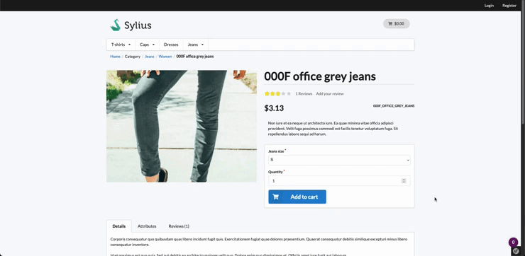

[](https://monsieurbiz.com/agence-web-experte-sylius)

<h1 align="center">Media Manager for Sylius</h1>

[](https://github.com/monsieurbiz/SyliusMediaManagerPlugin/blob/master/LICENSE.txt)
[](https://github.com/monsieurbiz/SyliusMediaManagerPlugin/actions/workflows/recipe.yaml)
[](https://github.com/monsieurbiz/SyliusMediaManagerPlugin/actions/workflows/tests.yaml)
[](https://github.com/monsieurbiz/SyliusMediaManagerPlugin/actions/workflows/security.yaml)



## Installation


Install the plugin via composer:

```bash
composer require monsieurbiz/sylius-media-manager-plugin
```

<!-- The section on the flex recipe will be displayed when the flex recipe will be available on contrib repo
<details><summary>For the installation without flex, follow these additional steps</summary>
-->

Change your `config/bundles.php` file to add this line for the plugin declaration:

```php
<?php

return [
    //..
    MonsieurBiz\SyliusMediaManagerPlugin\MonsieurBizSyliusMediaManagerPlugin::class => ['all' => true],
];
```

Copy the plugin configuration files in your `config` folder:

```bash
cp -Rv vendor/monsieurbiz/sylius-media-manager-plugin/recipes/1.0/config/ config
```

Add these variables to your `.env` :

```
MONSIEURBIZ_SYLIUS_MEDIA_MANAGER_PUBLIC_FOLDER=%kernel.project_dir%/public
MONSIEURBIZ_SYLIUS_MEDIA_MANAGER_ROOT_FOLDER_FROM_PUBLIC=media
MONSIEURBIZ_SYLIUS_MEDIA_MANAGER_MAX_FILE_SIZE=5M
```
<!-- </details> -->

Copy the templates in the folder `dist/templates/` to ensure that form fields are rendered correctly:

```
cp -R vendor/monsieurbiz/sylius-media-manager-plugin/dist/templates/bundles/* templates/bundles/
```

Copy the form extension if you want to use it on your product images.
```
cp -R vendor/monsieurbiz/sylius-media-manager-plugin/dist/src/Form/Extension/ProductImageTypeExtension.php src/Form/Extension/ProductImageTypeExtension.php
```

Else remove the file `templates/bundles/SyliusAdminBundle/Form/imagesTheme.html.twig`

## Use form types

You can check the [dist](https://github.com/monsieurbiz/SyliusMediaManagerPlugin/tree/master/dist) folder
to check how the plugin is setup on the test application.

### Images

Use `MonsieurBiz\SyliusMediaManagerPlugin\Form\Type\ImageType`

### PDF

Use `MonsieurBiz\SyliusMediaManagerPlugin\Form\Type\PdfType`

### Video

Use `MonsieurBiz\SyliusMediaManagerPlugin\Form\Type\VideoType`

### Favicon

Use `MonsieurBiz\SyliusMediaManagerPlugin\Form\Type\FaviconType`

### Audio

Use `MonsieurBiz\SyliusMediaManagerPlugin\Form\Type\AudioType`

### RichEditorPlugin

If you use our RichEditorPlugin the ImageType and VideoType are using the MediaManager.
In case you had the RichEditorPlugin before the MediaManagerPlugin you need to copy the folder `%kernel.project_dir%/public%/media/rich-editor` to `%kernel.project_dir%/public%/media/media/rich-editor` 
to keep the image from being displayed when they were uploaded through the richEditor and not the mediaManager.

## Contributing

You can find a way to run the plugin without effort in the file [DEVELOPMENT.md](./DEVELOPMENT.md).

Then you can open an issue or a Pull Request if you want! 😘  
Thank you!

## License

This plugin is completely free and released under the [MIT License](https://github.com/monsieurbiz/SyliusMediaManagerPlugin/blob/master/LICENSE).
